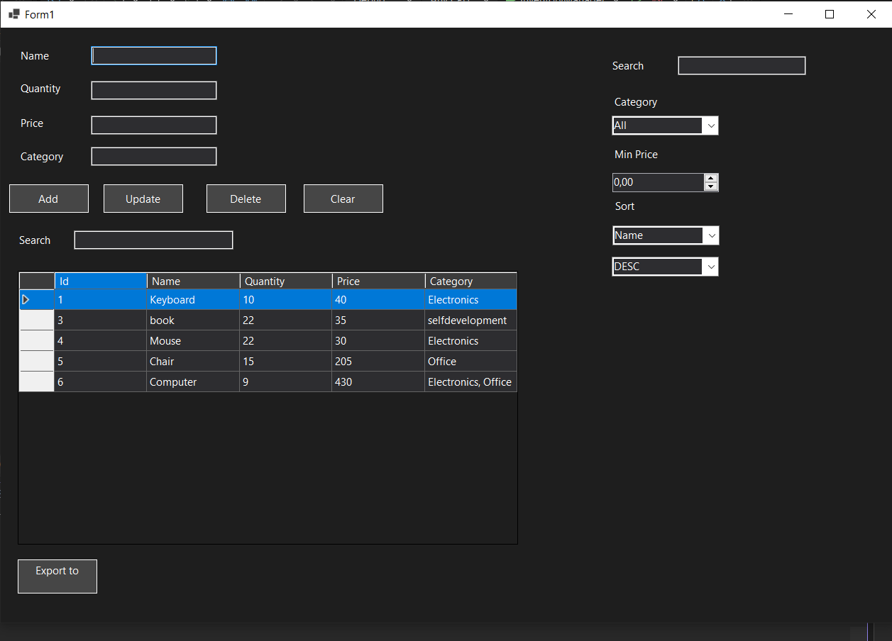
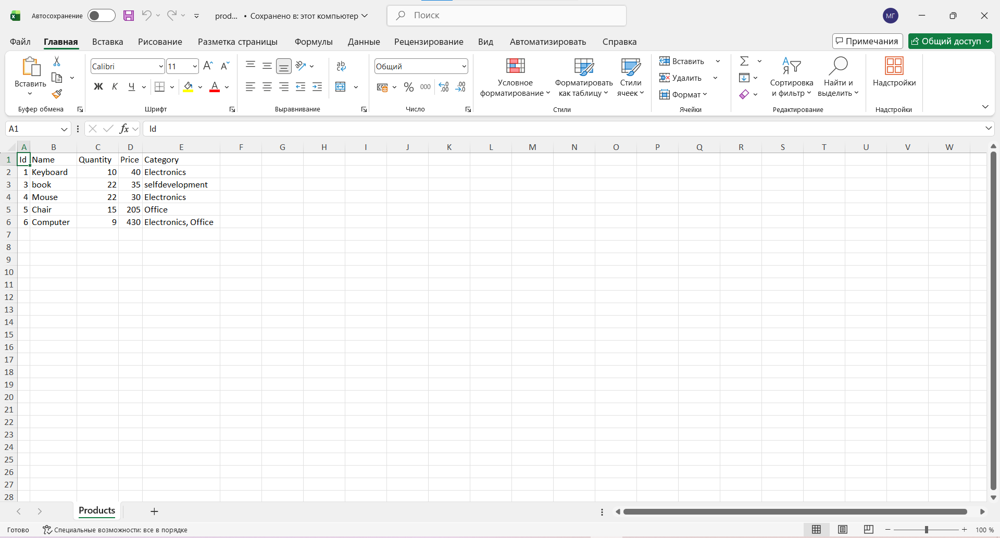

# Inventory Manager

Desktop inventory management application built with **C# WinForms** and **SQLite**.

The application allows users to manage products, search and filter inventory, sort data, and export products to Excel.

---

## Download

⬇ Ready-to-run version available in **Releases**

---

## Features

- Add products
- Edit existing products
- Delete products
- SQLite database storage
- Search products by name
- Filter by category
- Filter by minimum price
- Sort products by:
  - Name
  - Price
  - Quantity
- Export inventory to Excel
- Dark theme UI
- DataGridView integration

---

## Tech Stack

- C#
- .NET WinForms
- SQLite
- ClosedXML
- LINQ

---

## Screenshots

### Main Window



---

### Excel Export



---

## Project Structure

```text
InventoryManager
│
├── Models
│   └── Product.cs
│
├── Services
│   ├── DatabaseService.cs
│   └── ExcelExportService.cs
│
├── Form1.cs
├── Form1.Designer.cs
├── Program.cs
│
└── products.db
```

---

## Database

The application uses local SQLite database:

```text
products.db
```

The database is created automatically on first launch.

---

## Product Model

```csharp
public class Product
{
    [PrimaryKey, AutoIncrement]
    public int Id { get; set; }

    public string Name { get; set; }

    public int Quantity { get; set; }

    public decimal Price { get; set; }

    public string Category { get; set; }
}
```

---

## Main Functionality

### CRUD Operations

- Create new products
- Read products from SQLite database
- Update existing products
- Delete products

### Search & Filtering

Users can:

- Search products by name
- Filter by category
- Filter by minimum price

### Sorting

Products can be sorted by:

- Name
- Price
- Quantity

in both ascending and descending order.

### Excel Export

Inventory can be exported into:

```text
products.xlsx
```

using ClosedXML library.

---

## Installation

Clone repository:

```bash
git clone https://github.com/YOUR_USERNAME/inventory-manager.git
```

Open solution in Visual Studio and run the project.

---

## Future Improvements

- Product images
- Categories management
- Charts and analytics
- Import from Excel
- REST API integration
- Authentication
- Better UI styling

---

## Author

Junior C# Developer Portfolio Project

Built for learning desktop application development with:

- WinForms
- SQLite
- CRUD architecture
- Excel export
- Data filtering and sorting
